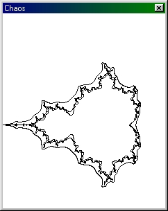



## Chaos v1\.01

### Description

Its a Math. programm with some different functions(e.g: Mandelbrot fractal, Trees etc...) - New Version(1.01)!
 
### More Info
 

             |
---                |---
**Submitted On**   |2001-04-14 23:47:32
**By**             |[Loreno Heer](https://github.com/Planet-Source-Code/PSCIndex/blob/master/ByAuthor/loreno-heer.md)
**Level**          |Advanced
**User Rating**    |4.0 (12 globes from 3 users)
**Compatibility**  |VB 6\.0
**Category**       |[Math/ Dates](https://github.com/Planet-Source-Code/PSCIndex/blob/master/ByCategory/math-dates__1-37.md)
**World**          |[Visual Basic](https://github.com/Planet-Source-Code/PSCIndex/blob/master/ByWorld/visual-basic.md)
**Archive File**   |[Chaos v1\_01837941420\.zip](https://github.com/Planet-Source-Code/loreno-heer-chaos-v1-01__1-21726/archive/master.zip)

